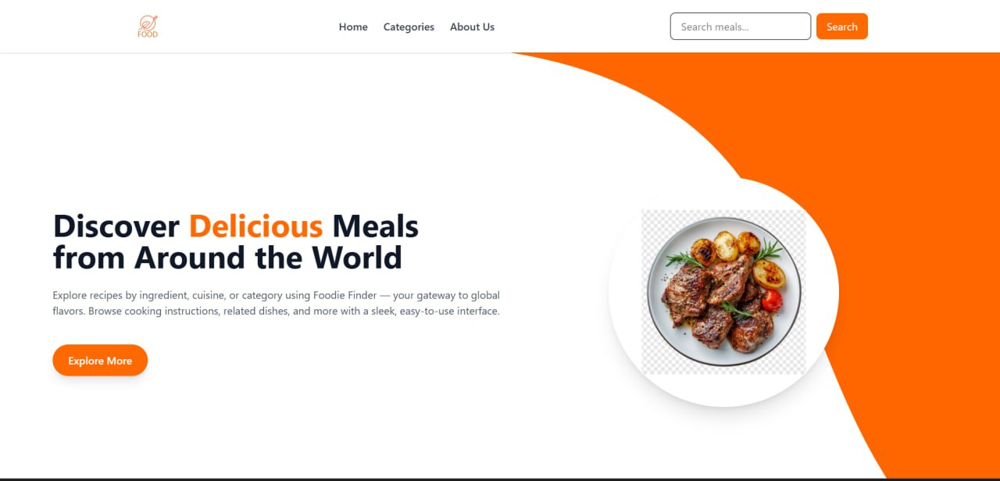

Foodie Finder is a React-based web application that lets users explore different food categories and meals. Users can browse categories, view meals within a category, and see detailed information about each meal. The app fetches data from [TheMealDB API](https://www.themealdb.com/api.php) and offers a clean, responsive interface built with Tailwind CSS.

## Features

- Browse food categories with thumbnail images.
- Click on a category to view meals in that category (initially shows 4 meals).
- Option to view all meals within a category.
- Click on a meal to see detailed information.
- Responsive design using Tailwind CSS.
- Simple navigation with React Router.

## Demo

https://foodie-finder-dun.vercel.app/
## Installation

1. Clone the repository:  
   git clone https://github.com/Ashtaa/Foodie_Finder.git  
   cd Foodie_Finder

2. Install dependencies:  
   npm install

3. Start the development server:  
   npm run dev

4. Open your browser and visit `http://localhost:5173`

## Technologies Used

- React
- React Router DOM
- Axios (for API calls)
- Tailwind CSS
- TheMealDB API

## API

Data is fetched from [TheMealDB](https://www.themealdb.com/api.php) public API.

- Categories endpoint: `/categories.php`
- Meals by category: `/filter.php?c=CategoryName`
- Meal details: `/lookup.php?i=MealID`

---

**Made with ❤️ by ashenfi,nahom,Zufan
